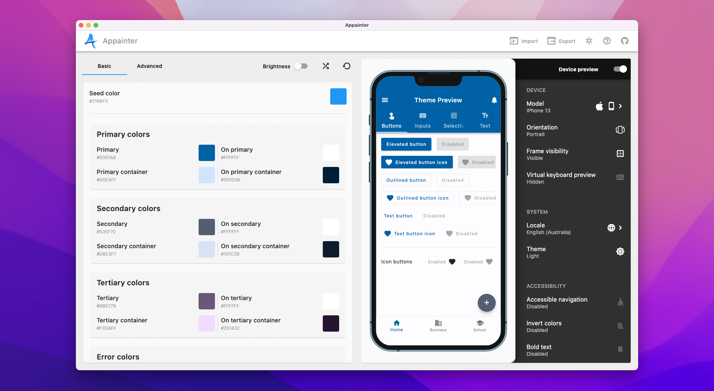

A material theme editor and generator for Flutter to configure and preview the overall visual theme of your material app.

## Usage

Appainter is developed and built with [Flutter](https://flutter.dev/), and is available for both Web and Desktop.

For Web, you can access it through [here](https://zeshuaro.github.io/appainter/). 

For Mac, Windows and Linux, you can be download it from [here](https://github.com/zeshuaro/appainter/releases).

### Using the Generated Theme

See [USAGE.md](USAGE.md) for instructions on how to use the generated theme.

## Development

Fork and clone the repository, then install the dependencies:

    flutter pub get

Run the following to launch the code generation:

    flutter pub run build_runner build --delete-conflicting-outputs

Start the app:

    flutter run